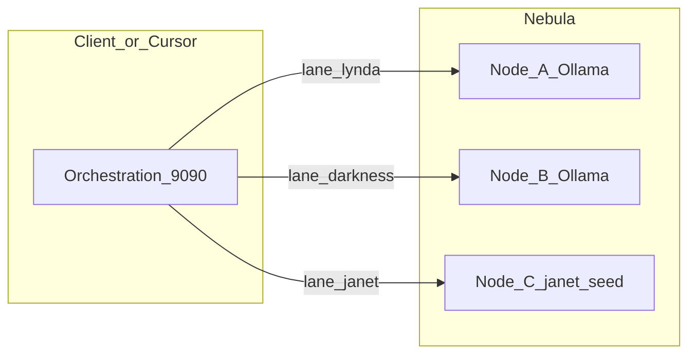

# Janet Nebula

**Many nodes, one sky for J.A.C.K.**

Per-lane inference on a **cluster**: route JACK (and Singularity Gather) personas to **different Ollama / janet-seed backends** on separate machines — real **multi-GPU / multi-host** parallel Gather instead of one queue on a single Mac.

**Status:** Planning / documentation (routing implementation lives in orchestration or jack-cluster; tracked here as the product story).

---

## Why Nebula?

On one machine, every JACK lane usually shares **one** `JANET_API_URL` → one janet-seed → **one** Ollama. Personas differ by **prompt**, not **server**.

In a **nebula** of nodes (LAN, Tailscale, Janet mesh), you map each lane to its own **star**:

- Spread **VRAM** and **compute** across GPUs.
- **Role-specific models** (e.g. heavier stack for Darkness, lighter for Janet).
- **Isolation** — one slow node need not stall every lane (with health + fallbacks, to be designed).

---

## Ecosystem links

Janet Nebula is a **sibling** to the main monorepo. When hacking implementation, clone [Janet-Projects](https://github.com/MzxzD/Janet-Projects) (or your full JANET umbrella).

| Piece | Role |
|-------|------|
| [janet_orchestration_module](https://github.com/MzxzD/Janet-Projects/tree/main/janet_orchestration_module) | Today: one janet-seed URL for all personas. **Extension:** persona → base URL / model. |
| `JACK_BACKEND=jack-cluster` | Same `/api/jack/process` contract; natural host for **multi-backend** routing. |
| [Janet-Model](https://github.com/MzxzD/Janet-Projects/tree/main/Janet-Model) | Custom weights per node if you want Janet-LM on one host and a coder base on another. |

Singularity × JACK (Gather presets, `max_parallel`) is documented in the **Power of &lt;3** workspace as `SINGULARITY_JACK.md` — Nebula changes **where** each lane runs, not the Gather protocol.

---

## Architecture (sketch)

- Resolver: `persona_id` → `{ base_url, model_id?, timeout_sec?, api_key? }`.
- Each lane: OpenAI-compatible `/v1/chat/completions`; use **`janet_use_client_messages: true`** where janet-seed supports per-lane system prompts.
- **Network:** Tailscale / private LAN; offline-first, **no cloud inference** required.

---

## Single Mac vs cluster

| Context | Recommendation |
|---------|----------------|
| **One GPU / one Mac** | One Ollama + prompt lanes + **`max_parallel`** tuning. |
| **Multi-node cluster** | **Janet Nebula** — explicit persona→backend map, ops runbook, degradation strategy. |

---

## Roadmap (implementation)

1. **Contract** — JSON/YAML: `persona_id` → `janet_api_url`, optional `default_model`, `timeout_sec`.
2. **Code** — extend `jack/dispatcher.py` or jack-cluster to select URL per persona ([dispatcher source](https://github.com/MzxzD/Janet-Projects/tree/main/janet_orchestration_module/jack)).
3. **Ops** — node labels, `ollama pull`, health checks, lane-level errors in `lanes[]`.
4. **Security** — env / Keychain for keys; optional mTLS between orchestrator and nodes.

---

## Non-goals

- Forcing multi-node for users who only have one box.
- Cloud-only LLM APIs as the default (cluster-local / sovereign first).

---

## Name

**Janet Nebula** — cool enough to remember, serious enough to ship.

Legacy label in some indexes: *Janet-Cluster-JACK* (same intent).

---

## License

MIT — see [LICENSE](LICENSE).

---

*Power of &lt;3. J.A.C.K. across the cluster.*
